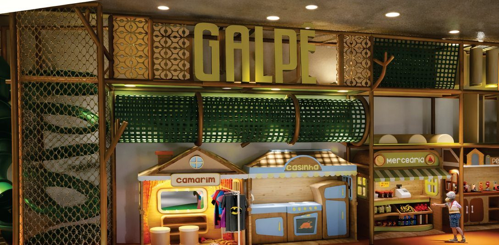

# 🎪 Galpê — Site Oficial

Site one-page premium para o **Galpê**, buffet infantil e espaço de festas em Teresópolis/RJ.

> *Diversão de criança. Estrutura de gente grande.*



## ✨ Features

- **Design system da marca**: paleta extraída da proposta oficial (creme `#F5EDDC`, marinho `#153765`, laranja `#D85427`, oliva `#A9A22F`), arcos, bordas onduladas e motion design com GSAP/ScrollTrigger
- **Simulador de orçamento com captura de lead**: o visitante deixa nome + WhatsApp (e, se quiser, aniversariante/idade/mês) → vira lead no CRM do admin → simula dia da semana × nº de convidados → valor por pessoa + total + mensagem personalizada pré-pronta no WhatsApp. Funciona offline do banco e lembra quem já se cadastrou
- **Cardápio completo** em 8 abas acessíveis (ARIA tabs)
- **Galeria** com lightbox navegável por teclado
- **SEO local**: JSON-LD `EventVenue` + `FAQPage`, Open Graph/Twitter Cards, otimizado para "buffet infantil Teresópolis"
- **Mobile-first**: testado em 340/390/768/1440px, menu fullscreen, zero layout shift (todas as imagens com `width/height`)
- **Zero dependências de build**: HTML/CSS/JS vanilla em arquivo único + assets otimizados (~1,4 MB)

## 🚀 Rodando localmente

Basta abrir `index.html` no navegador — ou:

```bash
python -m http.server 8765
# http://localhost:8765
```

## 📦 Deploy

Hospedagem estática em qualquer provedor (Vercel, Netlify, Cloudflare Pages, GitHub Pages). Não há etapa de build.

## 🛠 Manutenção rápida

| O quê | Onde |
| --- | --- |
| Preços | `index.html` → `var PRICES` |
| Gate de leads (campos/textos) | `index.html` → `form#simGate` |
| Telefone/WhatsApp | buscar `5521995060184` |
| Cardápio | seção `<!-- ======= CARDÁPIO ======= -->` |
| Fotos | pasta `assets/` |
| Pendências abertas | [`PENDENCIAS.md`](PENDENCIAS.md) |

## 🧭 Painel Admin (back-office)

`admin.html` — dashboard completo com login (Supabase): KPIs, calendário de festas com bloqueio de datas, CRM de leads (alimentado automaticamente pelo gate do simulador — responda rápido aos leads `novo`!), gerador de propostas com link público e aceite online (`proposta.html`), editor de preços/upgrades que atualiza o site em tempo real e ajustes das regras do negócio.

**Ativação (~10 min):** siga [`setup/SETUP-ADMIN.md`](setup/SETUP-ADMIN.md). Sem backend configurado, o site público funciona normalmente com os preços embutidos.

## 📍 Contato do cliente

**Galpê** · Rua Yeda, 184 – Tijuca, Teresópolis/RJ · (21) 99506-0184 · [@festanogalpe](https://www.instagram.com/festanogalpe/)

---

© Galpê – Espaço de Festas. Todos os direitos sobre marca, fotos e conteúdo reservados.
